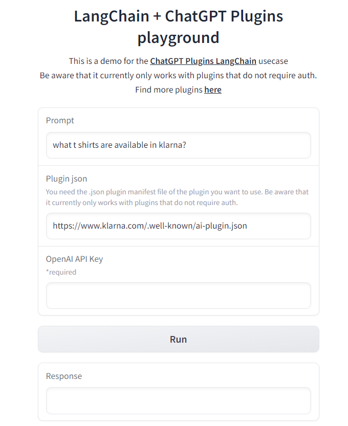

# LangChain + ChatGPT Plugins playground

This is a demo for the ChatGPT Plugins LangChain usecase.

**Note**: Be aware that it currently only works with plugins that do not require auth.



For free permanent hosting and GPU upgrades (NEW!), check out [Spaces](https://huggingface.co/spaces)

## Install libraries

```bash
pip install -r requirements.txt
```

## Run the application locally

```bash
gradio app.py
```
